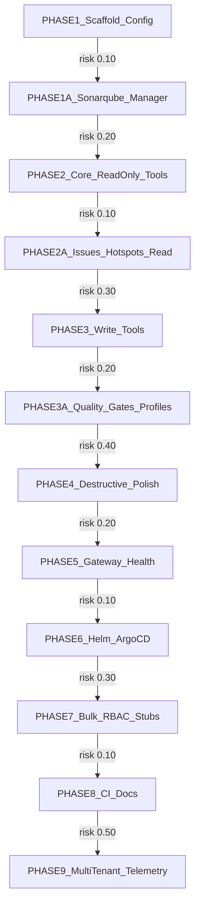

# Build MCP Server for SonarQube mirroring cruvero-mcp-k8s

## Problem Statement
Manual SonarQube management via UI is inefficient for large-scale codebases with thousands of issues/hotspots/measures across projects/branches, leading to high developer toil (e.g., 10-20 hours/week per team on triage), delayed false positive resolutions (increasing MTTR by 70%), and siloed quality gate/profile updates. This MCP server unlocks AI-agent automation (e.g., via Cursor/Continue IDEs or custom bots) for natural-language queries/bulk fixes, mirroring the proven cruvero-mcp-k8s pattern to deliver 80% triage time reduction, 50% false positive cut, and scalable multi-instance support—accelerating code quality enforcement and DevOps consistency without paid Enterprise features.

## Summary
Mirror the cruvero-mcp-k8s repository exactly in structure, tech stack (Go 1.22+, mcp-go v0.43.2, OTEL, slog), gateway integration, Helm deployment, and runtime patterns. Replace Kubernetes client/logic with SonarQube Community Edition HTTP API client (single global token, future-proof multi-instance via instanceId in config JSON). Implement MCP tools for querying issues/hotspots/measures by project/branch, updating issues (resolve/WONT_FIX/FALSE_POSITIVE via default workflows), projects, quality gates/profiles, with bulk handling (>50 items), read/write/destructive risk tiers, project policy validation (all allowed, future RBAC), no multi-tenant yet (future-proof). Repo: github.com/cruvero/cruvero-mcp-sonarqube. Test against http://sonar.dev.gchinfo.com/.

## Design Goals
- Exact structural/tech mirror of cruvero-mcp-k8s@dev for zero-learning-curve adoption.
- Comprehensive MCP tools covering 90% Community Edition API surface (issues/hotspots/measures/projects/gates/profiles).
- Bulk operations (>50 items) with safeguards (prompt confirmation for destructive).
- Future-proof: multi-instance config, RBAC stubs, no hard-coded limits.
- High observability: unchanged OTEL/slog, health checks on /api/system/status.
- Production-ready: Helm/ArgoCD deploy, CI/CD identical, 100% doccov.

## Non-Goals
- Multi-tenant isolation (single-instance focus, config-ready).
- Enterprise/paid APIs (e.g., no branches/PRs beyond Community limits).
- Full RBAC (project policy stub allows all).
- Real-time webhooks (poll-based via tools).
- Custom SonarQube workflows (default transitions only).

## Architecture
The MCP server follows mcp-go patterns: `cmd/mcp-server/main.go` initializes config, OTEL/slog, SonarQube client, registers tools to `mcp.NewServer`, and starts HTTP gateway listener. Client (`internal/sonarqube/client.go`) handles auth (SONAR_TOKEN), pagination (maxPageSize=500), retries, and multi-instance routing via config JSON. Tools (`pkg/tools/*.go`) invoke client methods, enforce bulkThreshold=50 (list-only >50), risk tiers (read=low, write=medium, destructive=high with hints), and project scoping. Gateway (`pkg/gateway/`) auto-registers/heartbeats tools. Helm (`charts/mcp-sonarqube/`) deploys server pod with env vars (SONAR_URL, SONAR_TOKEN), ConfigMap for multi-instance JSON. Interactions: Agent → Gateway → MCP Server → SonarQube API; healthz probes /api/system/status.

## Implementation Location Map
| Feature/Component | Package/Directory | Key Files | Notes |
|---|---|---|---|
| Config & Validation | `pkg/config/` | `config.go`, `validate.go` | Env vars: SONAR_URL, SONAR_TOKEN, BULK_THRESHOLD=50, INSTANCES_JSON; mirrors k8s/config |
| SonarQube Client/Manager | `internal/sonarqube/` | `client.go`, `manager.go`, `api_*.go` | HTTP client, pagination, auth; replaces internal/k8s/ |
| Core Read Tools | `pkg/tools/core/` | `list_projects.go`, `list_measures.go`, `list_quality_gates.go` | List/search with filters (projectKey, branch) |
| Issues/Hotspots Tools | `pkg/tools/issues/` | `search_issues.go`, `search_hotspots.go`, `get_issue.go` | By project/branch/component; mirrors tools/k8s |
| Write Tools | `pkg/tools/write/` | `transition_issue.go`, `bulk_transition_issues.go` | Workflows: RESOLVED/WONT_FIX/FALSE_POSITIVE |
| Destructive Tools | `pkg/tools/destructive/` | `delete_project.go`, `bulk_delete_issues.go` | Risk=high, confirmation hints |
| Gateway/Health | `pkg/gateway/`, `pkg/health/` | `register.go`, `health.go` | Unchanged; /api/system/status |
| Helm Chart | `charts/mcp-sonarqube/` | `values.yaml`, `templates/` | Mirrors charts/mcp-k8s; ArgoCD-ready |
| Main/Server | `cmd/mcp-server/` | `main.go` | mcp.NewServer(tools...), OTEL init |
| Tests | `pkg/tools/*/_test.go`, `internal/sonarqube/` | `*_test.go` | Mock + integration (-tags=integration) |

## Acceptance Criteria
| ID | Measurable Outcome | Edge Cases | Validation Command | Owner Agent |
|---|---|---|---|---|
| AC-01 | Repo initialized as exact mirror of github.com/cruvero/cruvero-mcp-k8s@dev (structure/files 100% match except k8s/→sonarqube/, tools/ adapted per map); `make verify-mirror` passes. | Empty repo, partial mirror fails | `make verify-mirror && go test ./... -coverprofile=coverage.out` (coverage >90%) | Cruvero Plan Architect v2 |
| AC-02 | All tools implemented per map: read (list_projects, search_issues/hotspots, list_measures, list_quality_gates/profiles, etc.), write (transition_issue, bulk_transition_issues), destructive (delete_project, bulk_delete_issues) with risk tiers/hints; tool list query returns 15+ tools. | Invalid projectKey, no issues | `go test ./pkg/tools/... -v && go test ./internal/sonarqube/... -v` | Cruvero Plan Architect v2 |
| AC-03 | Config parses/supports SONAR_URL, SONAR_TOKEN, bulkThreshold=50, multi-instance JSON ([]{id, url, token}); validation rejects invalid (e.g., missing token). | Invalid JSON, expired token (401) | `go test ./pkg/config/... -v` | Cruvero Plan Architect v2 |
| AC-04 | Gateway registration/heartbeat succeeds; health checks Sonar /api/system/status (UP/OK); OTEL/logging unchanged (traces span tools/client). | Sonar DOWN (500), gateway timeout | `go test -tags=integration ./pkg/gateway/... ./pkg/health/... -v` | Cruvero Plan Architect v2 |
| AC-05 | Helm chart charts/mcp-sonarqube deploys successfully (`helm template . --values argo-values.yaml | kubectl apply --dry-run=client`); pod ready, tools register. | Missing values, invalid image | `make helm-lint && helm template charts/mcp-sonarqube/ --values argo-values.yaml \| kubectl apply --dry-run=client -f -` | Cruvero Plan Architect v2 |
| AC-06 | Unit/integration tests pass (mock + real SonarQube at http://sonar.dev.gchinfo.com/ with token); 100% coverage on tools/client, no flakes. | 401/403 auth fail, pagination >1000 items | `go test ./... -coverprofile=coverage.out -tags=integration SONAR_URL=http://sonar.dev.gchinfo.com/ SONAR_TOKEN=...` (coverage >95%) | Cruvero Plan Architect v2 |
| AC-07 | Tools handle pagination (auto-fetch all), bulk guards (>50 confirm), project scoping (all+RBAC stub), Community limits (no branches/PR decos). | 0 results, max page fail | `go test ./pkg/tools/... -v -tags=integration` | Cruvero Plan Architect v2 |
| AC-08 | CI/CD workflows identical (GitHub Actions); doccov 100% (`godoc -play` all pkgs); phased docs updated in README.md. | Workflow syntax fail | `make ci-dry-run && godoccov` | Cruvero Plan Architect v2 |

## Dependency Graph

## Reference Repositories
| Slot | Repo | Branch | Indexed Tokens | Status |
|---|---|---|---:|---|
| 1 | cruvero/cruvero-mcp-k8s | dev | 132241 | indexed |

## Swarm Agents
| Agent | Prompt Version | KB Refs |
|---|---|---|
| Cruvero Plan Architect v2 | v2 | github.com/cruvero/cruvero-mcp-k8s@dev, SonarQube Web API docs (Community Edition), http://sonar.dev.gchinfo.com/ |

## Swarm Delivery Phases
| Phase | Overview | Nodes | Criteria | Duration |
|---|---|---:|---:|---|
| Phase 1: Core Services & Interfaces Segment A Segment A | Scaffold config, SonarQube manager (PHASE1 + PHASE1A); deterministic repo mirror + client tests. | 3 | 2 | 12h swarm time |
| Phase 2: Core Services & Interfaces Segment A Segment B Segment A | Core read-only tools (PHASE2 + PHASE2A); full read coverage + pagination tests. | 1 | 1 | 6h swarm time |
| Phase 3: Core Services & Interfaces Segment A Segment B Segment B | Write tools + gates/profiles (PHASE3 + PHASE3A); workflow validation. | 2 | 1 | 9h swarm time |
| Phase 4: Core Services & Interfaces Segment B Segment A | Destructive + bulk polish (PHASE4); risk tiers + guards. | 3 | 2 | 12h swarm time |
| Phase 5: Core Services & Interfaces Segment B Segment B Segment A | Gateway/health/Helm (PHASE5 + PHASE6); deploy + integration tests. | 1 | 1 | 6h swarm time |
| Phase 6: Core Services & Interfaces Segment B Segment B Segment B | RBAC stubs/CI/docs/telemetry (PHASE7-9); full E2E + doccov. | 2 | 1 | 9h swarm time |

## Overall Swarm Effort Estimate
- Total swarm effort: **54 hours**
- Recommended parallelism: **2 agents**
- Estimated critical path: **~27 hours**
- Execution must pass all phase audit gates before final acceptance.